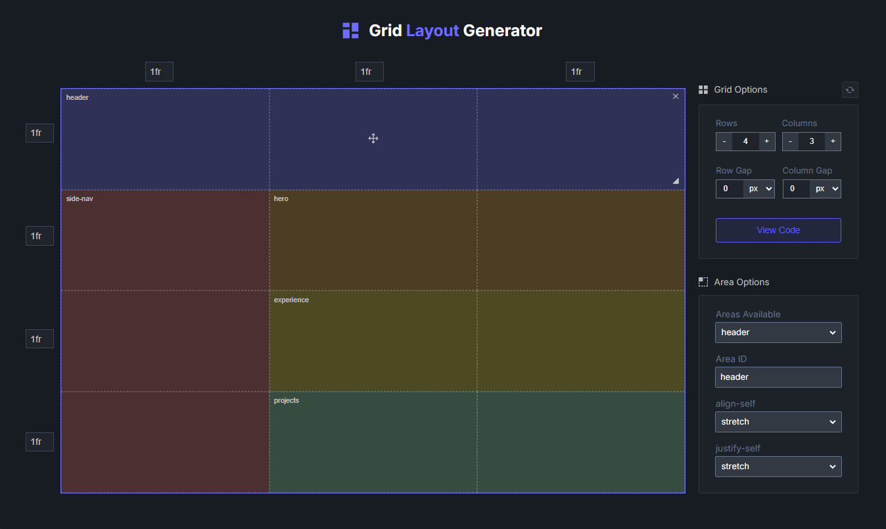

<div align="center">

# Grid Layout Generator

[🚀 Getting Started](#getting-started) • [📜 Scripts](#scripts) • [✨ Acknowledgments](#acknowledgments) • [🗺️ Roadmap](#roadmap) • [🤝 Contributing](#contributing)


</div>

The **Grid Layout Generator** is a web-based tool created with React and Vite, designed to simplify the creation of CSS grid layouts. It allows users to visually design grids, manage grid areas, and provides options to copy or download the generated HTML and CSS code.

### Live: [https://gridlayoutgenerator.com](https://gridlayouttgenerator.com)



## Features

- **Resizable Grid Layout**: Adjust the number of rows and columns dynamically, and set their sizes using any CSS unit (px, %, fr, etc.).

- **Area Management**:

  - Add new areas by clicking on any cell.
  - Resize, move, or delete areas using the handles or through area options.
  - Rename areas for better identification.

- **Alignment Options**: Customize the alignment of individual areas using `align-self` and `justify-self` properties.

- **Code Generation**:
  - Copy the code to your clipboard.
  - Download the code as a file for future use.

---

## Getting Started

Follow these steps to set up the project locally:

1. **Clone the repository**

   ```bash
   git clone https://github.com/NethminaGunasekara/grid-layout-generator.git
   ```

2. **Navigate to the project directory**

   ```bash
   cd grid-layout-generator
   ```

3. **Install dependencies**

   ```bash
   npm install
   ```

4. **Run the development server**

   ```bash
   npm run dev
   ```

5. Open the app in your browser at `http://localhost:5173`.

---

### Scripts

This project includes the following npm scripts:

- `dev`: Starts the development server using Vite.
- `build`: Builds the project using TypeScript and Vite for production.
- `lint`: Runs ESLint to analyze the code for issues.
- `preview`: Serves the production build locally using Vite.
- `test`: Runs unit tests using Vitest.

### Steps

1. Start the development server to work on the project:

   ```bash
   npm run dev
   ```

2. Run tests to ensure code quality and reliability:

   ```bash
   npm run test
   ```

3. Lint your code for any issues:

   ```bash
   npm run lint
   ```

4. Build the app for production:

   ```bash
   npm run build
   ```

5. Preview the production build locally:

   ```bash
   npm run preview
   ```

---

---

## Acknowledgments

This project was built with the help of:

- [**React Toastify**](https://www.npmjs.com/package/react-toastify) for toast messages.

- [**SVG Repo**](https://www.svgrepo.com) for icons.

- [**Netlify**](https://www.netlify.com) for hosting.

- [**Husky**](https://typicode.github.io/husky/) and [**lint-staged**](https://www.npmjs.com/package/lint-staged) for pre-commit checks.

- [**React Code Blocks**](https://www.npmjs.com/package/react-code-blocks) for previewing the HTML/CSS code for the grid.

- [**@fontsource**](https://fontsource.org/docs/getting-started/introduction) for web fonts.

## Roadmap

- Add support for `grid-template-areas`.
- Add support for [Tailwind CSS](https://tailwindcss.com/)

---

## Contributing

Contributions are welcome! If you have ideas, suggestions, or find a bug, please open an issue or submit a pull request.

---
